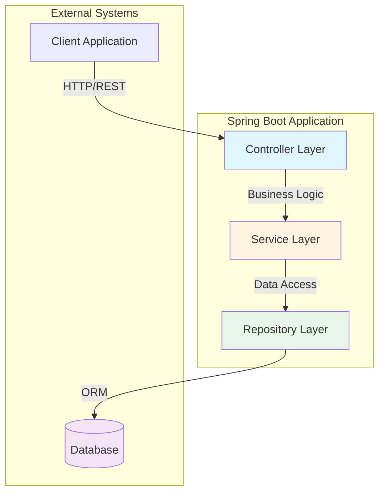
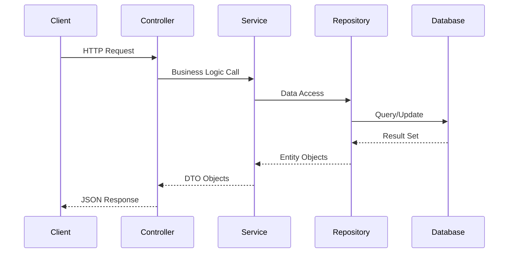
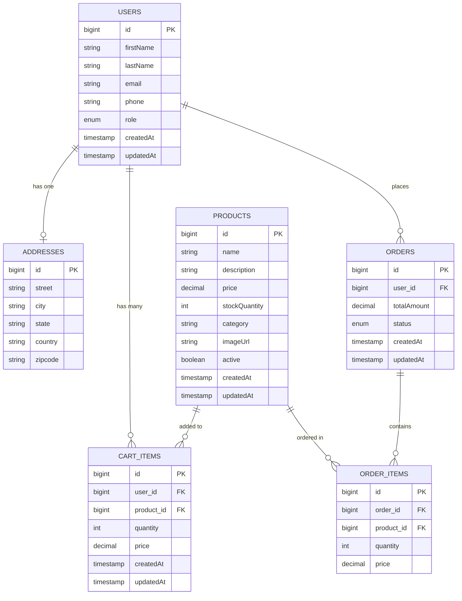
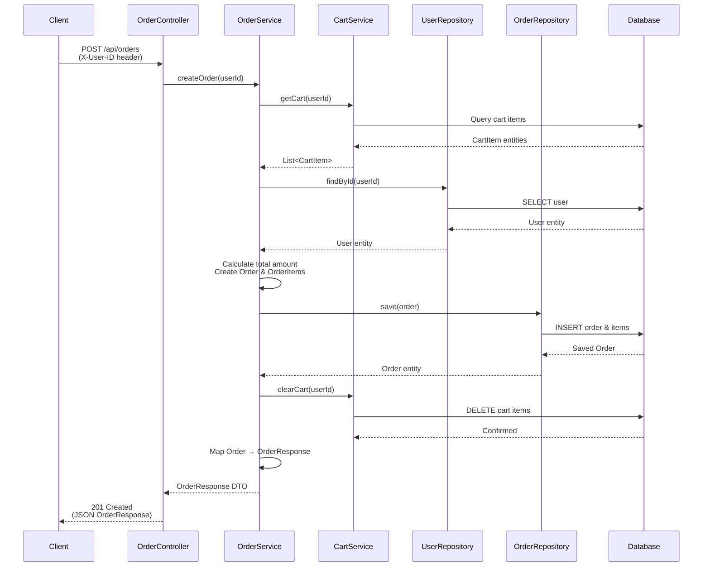
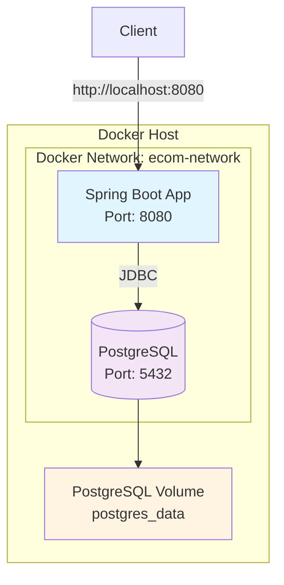
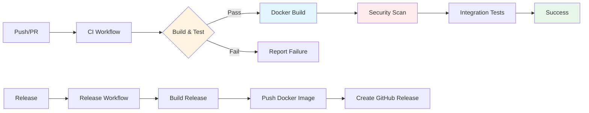
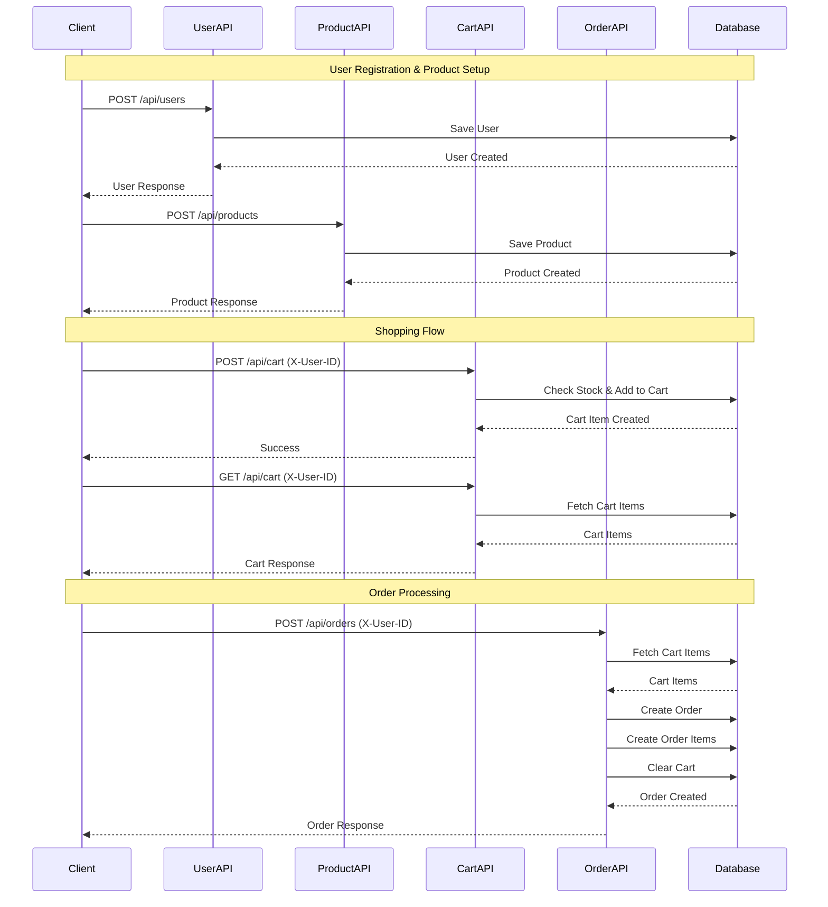

# 🛒 E-Commerce Application

A modern, RESTful e-commerce application built with Spring Boot, providing comprehensive functionality for managing users, products, shopping carts, and orders.

## 📋 Table of Contents

- [Features](#-features)
- [Technology Stack](#-technology-stack)
- [Architecture](#-architecture)
- [Database Schema](#-database-schema)
- [API Documentation](#-api-documentation)
- [Project Structure](#-project-structure)
- [Getting Started](#-getting-started)
- [Docker Deployment](#-docker-deployment)
- [CI/CD](#-cicd)
- [Configuration](#-configuration)
- [API Flow](#-api-flow)

## ✨ Features

- **User Management**: Create, read, update user profiles with address information
- **Product Management**: Full CRUD operations for products with search functionality
- **Shopping Cart**: Add/remove items, manage quantities, view cart contents
- **Order Processing**: Create orders from cart items with automatic cart clearing
- **Inventory Management**: Track product stock quantities
- **Role-Based Access**: Support for CUSTOMER and ADMIN roles
- **Order Status Tracking**: Track orders through PENDING, CONFIRMED, SHIPPED, DELIVERED, CANCELLED states

## 🛠 Technology Stack

- **Framework**: Spring Boot 4.0.0
- **Java Version**: 21
- **Build Tool**: Maven
- **Database**: 
  - H2 (In-Memory) - Development
  - PostgreSQL - Production Ready
- **ORM**: Spring Data JPA / Hibernate
- **Libraries**:
  - Lombok - Boilerplate reduction
  - Spring Boot Actuator - Application monitoring
- **Architecture**: RESTful API, Layered Architecture

## 🏗 Architecture

### System Architecture



### Application Flow



## 🗄 Database Schema

### Entity Relationship Diagram



### Entity Relationships

| Relationship | Type | Description |
|-------------|------|-------------|
| User ↔ Address | One-to-One | Each user has one address (optional) |
| User ↔ CartItem | One-to-Many | A user can have multiple cart items |
| User ↔ Order | One-to-Many | A user can place multiple orders |
| Product ↔ CartItem | One-to-Many | A product can be in multiple carts |
| Product ↔ OrderItem | One-to-Many | A product can appear in multiple orders |
| Order ↔ OrderItem | One-to-Many | An order contains multiple items |

## 📡 API Documentation

### Base URL
```
http://localhost:8080/api
```

### User Endpoints

| Method | Endpoint | Description | Request Body |
|--------|----------|-------------|--------------|
| `GET` | `/users` | Get all users | - |
| `GET` | `/users/{id}` | Get user by ID | - |
| `POST` | `/users` | Create new user | `UserRequest` |
| `PUT` | `/users/{id}` | Update user | `UserRequest` |

**UserRequest Example:**
```json
{
  "firstName": "John",
  "lastName": "Doe",
  "email": "john.doe@example.com",
  "phone": "+1234567890",
  "role": "CUSTOMER",
  "address": {
    "street": "123 Main St",
    "city": "New York",
    "state": "NY",
    "country": "USA",
    "zipcode": "10001"
  }
}
```

### Product Endpoints

| Method | Endpoint | Description | Request Body |
|--------|----------|-------------|--------------|
| `GET` | `/products` | Get all active products | - |
| `GET` | `/products/search?keyword={keyword}` | Search products | - |
| `POST` | `/products` | Create new product | `ProductRequest` |
| `PUT` | `/products/{id}` | Update product | `ProductRequest` |
| `DELETE` | `/products/{id}` | Soft delete product | - |

**ProductRequest Example:**
```json
{
  "name": "Laptop",
  "description": "High-performance laptop",
  "price": 999.99,
  "stockQuantity": 50,
  "category": "Electronics",
  "imageUrl": "https://example.com/laptop.jpg"
}
```

### Cart Endpoints

| Method | Endpoint | Description | Headers | Request Body |
|--------|----------|-------------|---------|--------------|
| `GET` | `/cart` | Get user's cart | `X-User-ID` | - |
| `POST` | `/cart` | Add item to cart | `X-User-ID` | `CartItemRequest` |
| `DELETE` | `/cart/items/{productId}` | Remove item from cart | `X-User-ID` | - |

**CartItemRequest Example:**
```json
{
  "productId": 1,
  "quantity": 2
}
```

### Order Endpoints

| Method | Endpoint | Description | Headers | Request Body |
|--------|----------|-------------|---------|--------------|
| `POST` | `/orders` | Create order from cart | `X-User-ID` | - |

**OrderResponse Example:**
```json
{
  "id": 1,
  "totalAmount": 1999.98,
  "status": "CONFIRMED",
  "items": [
    {
      "id": 1,
      "productId": 1,
      "quantity": 2,
      "price": 1999.98,
      "subtotal": 1999.98
    }
  ],
  "createdAt": "2024-01-15T10:30:00"
}
```

## 📁 Project Structure

```
ecom-application/
│
├── src/
│   ├── main/
│   │   ├── java/com/app/ecom/
│   │   │   ├── EcomApplication.java          # Main application class
│   │   │   │
│   │   │   ├── controller/                   # REST Controllers
│   │   │   │   ├── UserController.java
│   │   │   │   ├── ProductController.java
│   │   │   │   ├── CartController.java
│   │   │   │   └── OrderController.java
│   │   │   │
│   │   │   ├── service/                      # Business Logic Layer
│   │   │   │   ├── UserService.java
│   │   │   │   ├── ProductService.java
│   │   │   │   ├── CartService.java
│   │   │   │   └── OrderService.java
│   │   │   │
│   │   │   ├── repository/                   # Data Access Layer
│   │   │   │   ├── UserRepository.java
│   │   │   │   ├── ProductRepository.java
│   │   │   │   ├── CartItemRepository.java
│   │   │   │   └── OrderRepository.java
│   │   │   │
│   │   │   ├── model/                        # Entity Models
│   │   │   │   ├── User.java
│   │   │   │   ├── Address.java
│   │   │   │   ├── Product.java
│   │   │   │   ├── CartItem.java
│   │   │   │   ├── Order.java
│   │   │   │   ├── OrderItem.java
│   │   │   │   ├── UserRole.java
│   │   │   │   └── OrderStatus.java
│   │   │   │
│   │   │   └── dto/                          # Data Transfer Objects
│   │   │       ├── UserRequest.java
│   │   │       ├── UserResponse.java
│   │   │       ├── ProductRequest.java
│   │   │       ├── ProductResponse.java
│   │   │       ├── CartItemRequest.java
│   │   │       ├── OrderResponse.java
│   │   │       ├── OrderItemDTO.java
│   │   │       └── AddressDTO.java
│   │   │
│   │   └── resources/
│   │       ├── application.properties         # Configuration
│   │       ├── static/                       # Static resources
│   │       └── templates/                    # Template files
│   │
│   └── test/
│       └── java/com/app/ecom/
│           └── EcomApplicationTests.java
│
├── pom.xml                                    # Maven configuration
├── mvnw                                       # Maven wrapper (Unix)
├── mvnw.cmd                                   # Maven wrapper (Windows)
└── README.md                                  # This file
```

### Layer Architecture

The application follows a **3-Layer Architecture** pattern with clear separation of concerns:

```mermaid
graph TB
    subgraph Client["🌐 Client Layer"]
        HTTP[HTTP/REST Client]
    end
    
    subgraph Layer1["📡 Layer 1: Presentation Layer<br/>(REST Controllers)"]
        direction LR
        UC["`**UserController**<br/>/api/users`"]
        PC["`**ProductController**<br/>/api/products`"]
        CC["`**CartController**<br/>/api/cart`"]
        OC["`**OrderController**<br/>/api/orders`"]
    end
    
    subgraph DTOs["📦 Data Transfer Objects<br/>(Request/Response)"]
        direction TB
        UReq[UserRequest]
        URes[UserResponse]
        PReq[ProductRequest]
        PRes[ProductResponse]
        CReq[CartItemRequest]
        ORes[OrderResponse]
    end
    
    subgraph Layer2["⚙️ Layer 2: Business Logic Layer<br/>(Services)"]
        direction LR
        US["`**UserService**<br/>User Management`"]
        PS["`**ProductService**<br/>Product CRUD`"]
        CS["`**CartService**<br/>Cart Operations`"]
        OS["`**OrderService**<br/>Order Processing`"]
    end
    
    subgraph Layer3["💾 Layer 3: Data Access Layer<br/>(Repositories)"]
        direction LR
        UR["`**UserRepository**<br/>User Data**"]
        PR["`**ProductRepository**<br/>Product Data**"]
        CR["`**CartItemRepository**<br/>Cart Data**"]
        OR["`**OrderRepository**<br/>Order Data**"]
    end
    
    subgraph Entities["🗃️ Entity Models<br/>(JPA Entities)"]
        direction TB
        UM[User Entity]
        AM[Address Entity]
        PM[Product Entity]
        CM[CartItem Entity]
        OM[Order Entity]
        OIM[OrderItem Entity]
    end
    
    subgraph DB["🗄️ Database<br/>(PostgreSQL/H2)"]
        Database[(Database)]
    end
    
    %% Client to Controllers
    HTTP -->|HTTP Requests| UC
    HTTP -->|HTTP Requests| PC
    HTTP -->|HTTP Requests| CC
    HTTP -->|HTTP Requests| OC
    
    %% Controllers to DTOs (Input)
    UC -.->|Receives| UReq
    PC -.->|Receives| PReq
    CC -.->|Receives| CReq
    
    %% Controllers to Services
    UC -->|Calls| US
    PC -->|Calls| PS
    CC -->|Calls| CS
    OC -->|Calls| OS
    
    %% Services to DTOs (Output)
    US -.->|Returns| URes
    PS -.->|Returns| PRes
    OS -.->|Returns| ORes
    
    %% Controllers to DTOs (Output)
    UC -.->|Sends| URes
    PC -.->|Sends| PRes
    OC -.->|Sends| ORes
    
    %% Services to Repositories
    US -->|Uses| UR
    PS -->|Uses| PR
    CS -->|Uses| CR
    CS -->|Uses| PR
    CS -->|Uses| UR
    OS -->|Uses| OR
    OS -->|Uses| UR
    OS -->|Uses| CS
    
    %% Repositories to Entities
    UR -->|Manages| UM
    PR -->|Manages| PM
    CR -->|Manages| CM
    OR -->|Manages| OM
    
    %% Entity Relationships
    UM -->|One-to-One| AM
    CM -->|Many-to-One| UM
    CM -->|Many-to-One| PM
    OM -->|One-to-Many| OIM
    OM -->|Many-to-One| UM
    OIM -->|Many-to-One| OM
    OIM -->|Many-to-One| PM
    
    %% Repositories to Database
    UR -->|Queries| Database
    PR -->|Queries| Database
    CR -->|Queries| Database
    OR -->|Queries| Database
    
    %% Styling
    style Layer1 fill:#e3f2fd,stroke:#1976d2,stroke-width:2px
    style Layer2 fill:#fff3e0,stroke:#f57c00,stroke-width:2px
    style Layer3 fill:#e8f5e9,stroke:#388e3c,stroke-width:2px
    style DTOs fill:#f3e5f5,stroke:#7b1fa2,stroke-width:2px
    style Entities fill:#fce4ec,stroke:#c2185b,stroke-width:2px
    style DB fill:#e0f2f1,stroke:#00796b,stroke-width:2px
    style Client fill:#fff9c4,stroke:#f9a825,stroke-width:2px
```

### Layer Responsibilities

| Layer | Components | Responsibility | Example |
|-------|-----------|----------------|---------|
| **Presentation** | Controllers | Handle HTTP requests, validate input, return responses | `UserController` receives `UserRequest`, calls `UserService`, returns `UserResponse` |
| **Business Logic** | Services | Implement business rules, orchestrate operations, transform data | `OrderService` validates cart, calculates total, creates order, clears cart |
| **Data Access** | Repositories | Database operations, CRUD operations, queries | `UserRepository` finds, saves, updates `User` entities |
| **Entity Models** | JPA Entities | Represent database tables, define relationships | `User` entity maps to `users` table with `Address` relationship |

### Data Flow Example: Creating an Order



### Cross-Layer Dependencies

- **OrderService → CartService**: Order creation uses cart service to get and clear cart items
- **CartService → UserRepository & ProductRepository**: Cart operations need user and product data
- **OrderService → UserRepository**: Order creation validates user existence

## 🚀 Getting Started

### Prerequisites

- **Java 21** or higher
- **Maven 3.6+** (or use Maven Wrapper included)
- **PostgreSQL** (optional, for production)
- **IDE** (IntelliJ IDEA, Eclipse, VS Code recommended)

### Installation Steps

1. **Clone the repository**
   ```bash
   git clone <repository-url>
   cd ecom-application
   ```

2. **Build the project**
   ```bash
   ./mvnw clean install
   ```
   Or on Windows:
   ```bash
   mvnw.cmd clean install
   ```

3. **Run the application**
   ```bash
   ./mvnw spring-boot:run
   ```
   Or on Windows:
   ```bash
   mvnw.cmd spring-boot:run
   ```

4. **Access the application**
   - Application: `http://localhost:8080`
   - H2 Console: `http://localhost:8080/h2-console`
   - Actuator: `http://localhost:8080/actuator`

### H2 Database Console Access

1. Navigate to `http://localhost:8080/h2-console`
2. Use the following connection details:
   - **JDBC URL**: `jdbc:h2:mem:testdb`
   - **Username**: `sa`
   - **Password**: (leave empty)

## 🐳 Docker Deployment

### Prerequisites

- **Docker** 20.10+ 
- **Docker Compose** 2.0+

### Quick Start with Docker

1. **Build and run with Docker Compose**
   ```bash
   docker-compose up --build
   ```
   
   This will:
   - Build the Spring Boot application image
   - Start PostgreSQL database
   - Start the application
   - Set up networking between services

2. **Run in detached mode (background)**
   ```bash
   docker-compose up -d
   ```

3. **View logs**
   ```bash
   # All services
   docker-compose logs -f
   
   # Specific service
   docker-compose logs -f app
   docker-compose logs -f postgres
   ```

4. **Stop services**
   ```bash
   docker-compose down
   ```

5. **Stop and remove volumes (clean database)**
   ```bash
   docker-compose down -v
   ```

### Docker Architecture



### Docker Commands

#### Build the application image
```bash
docker build -t ecom-application:latest .
```

#### Run application container (standalone)
```bash
docker run -d \
  --name ecom-app \
  -p 8080:8080 \
  -e SPRING_DATASOURCE_URL=jdbc:postgresql://host.docker.internal:5432/ecomdb \
  -e SPRING_DATASOURCE_USERNAME=postgres \
  -e SPRING_DATASOURCE_PASSWORD=postgres \
  ecom-application:latest
```

#### Run PostgreSQL container
```bash
docker run -d \
  --name ecom-postgres \
  -e POSTGRES_DB=ecomdb \
  -e POSTGRES_USER=postgres \
  -e POSTGRES_PASSWORD=postgres \
  -p 5432:5432 \
  -v postgres_data:/var/lib/postgresql/data \
  postgres:15-alpine
```

### Docker Compose Services

| Service | Image | Port | Description |
|---------|-------|------|-------------|
| `app` | `ecom-application:latest` | 8080 | Spring Boot application |
| `postgres` | `postgres:15-alpine` | 5432 | PostgreSQL database |

### Environment Variables

You can customize the Docker setup by creating a `.env` file:

```env
POSTGRES_DB=ecomdb
POSTGRES_USER=postgres
POSTGRES_PASSWORD=postgres
SPRING_DATASOURCE_URL=jdbc:postgresql://postgres:5432/ecomdb
SPRING_DATASOURCE_USERNAME=postgres
SPRING_DATASOURCE_PASSWORD=postgres
```

Then use it with:
```bash
docker-compose --env-file .env up
```

### Health Checks

Both services include health checks:

- **Application**: `http://localhost:8080/actuator/health`
- **PostgreSQL**: Automatic readiness check

Check service health:
```bash
docker-compose ps
```

### Accessing the Application

Once containers are running:

- **Application**: `http://localhost:8080`
- **API Endpoints**: `http://localhost:8080/api/*`
- **Actuator**: `http://localhost:8080/actuator`
- **PostgreSQL**: `localhost:5432`

### Database Access

Connect to PostgreSQL from host machine:

```bash
docker exec -it ecom-postgres psql -U postgres -d ecomdb
```

Or use any PostgreSQL client with:
- **Host**: `localhost`
- **Port**: `5432`
- **Database**: `ecomdb`
- **Username**: `postgres`
- **Password**: `postgres`

### Troubleshooting

**Application won't start:**
```bash
# Check logs
docker-compose logs app

# Restart services
docker-compose restart app
```

**Database connection issues:**
```bash
# Verify PostgreSQL is running
docker-compose ps postgres

# Check database logs
docker-compose logs postgres
```

**Rebuild after code changes:**
```bash
docker-compose up --build
```

## 🔄 CI/CD

This project includes comprehensive GitHub Actions workflows for continuous integration and deployment.

### Workflows

#### 1. **CI Workflow** (`.github/workflows/ci.yml`)

Runs on every push and pull request to main/master/develop branches:

- ✅ **Build and Test**: Compiles code and runs unit tests with PostgreSQL
- 🐳 **Docker Build**: Builds Docker image (on non-PR events)
- 🔍 **Code Quality**: Validates POM and runs code quality checks
- 🔒 **Security Scan**: OWASP Dependency Check for vulnerability scanning
- 🧪 **Integration Tests**: Docker Compose integration tests

**Features:**
- Maven dependency caching for faster builds
- PostgreSQL service for integration testing
- Test result artifacts upload
- JAR artifact upload for releases

#### 2. **Release Workflow** (`.github/workflows/release.yml`)

Triggered on GitHub releases or manual dispatch:

- 📦 **Build Release**: Creates production-ready JAR
- 🐳 **Docker Release**: Builds and pushes versioned Docker images
- 🏷️ **Version Tagging**: Tags images with version numbers

#### 3. **Docker Build Workflow** (`.github/workflows/docker-build.yml`)

Triggered on Dockerfile changes or manual dispatch:

- 🐳 **Docker Build**: Builds Docker image with caching
- ✅ **Docker Test**: Tests the built image

### CI/CD Pipeline Flow



### Workflow Status Badge

Add this to your README to show CI status:

```markdown

```

### Required GitHub Secrets

For Docker Hub integration, configure these secrets in your repository:

1. Go to **Settings** → **Secrets and variables** → **Actions**
2. Add the following secrets:

| Secret Name | Description | Example |
|------------|-------------|---------|
| `DOCKERHUB_USERNAME` | Your Docker Hub username | `yourusername` |
| `DOCKERHUB_TOKEN` | Docker Hub access token | `dckr_pat_...` |

**To create a Docker Hub token:**
1. Go to Docker Hub → Account Settings → Security
2. Click "New Access Token"
3. Copy the token and add it as `DOCKERHUB_TOKEN` secret

### Workflow Triggers

| Event | Workflow | Description |
|-------|----------|-------------|
| Push to main/master/develop | CI | Runs build, test, and Docker build |
| Pull Request | CI | Runs build and test only |
| Release created | Release | Builds and publishes release artifacts |
| Manual dispatch | All | Manually trigger any workflow |

### Local Testing

Test workflows locally using [act](https://github.com/nektos/act):

```bash
# Install act
curl https://raw.githubusercontent.com/nektos/act/master/install.sh | sudo bash

# List workflows
act -l

# Run CI workflow
act push

# Run with specific event
act pull_request
```

### Build Artifacts

The CI workflow generates and stores:

- **Test Results**: Uploaded to workflow artifacts (30 days retention)
- **JAR Files**: Application JAR files (7 days retention)
- **Docker Images**: Pushed to Docker Hub (if configured)

### Monitoring

- View workflow runs: **Actions** tab in GitHub
- Check build status: Workflow badges in README
- Download artifacts: Available in workflow run details

## ⚙️ Configuration

### Application Properties

The application uses H2 in-memory database by default. To switch to PostgreSQL:

```properties
# PostgreSQL Configuration
spring.datasource.url=jdbc:postgresql://localhost:5432/ecomdb
spring.datasource.username=your_username
spring.datasource.password=your_password
spring.datasource.driver-class-name=org.postgresql.Driver
spring.jpa.hibernate.ddl-auto=update
```

### Environment Variables

You can override configuration using environment variables:

```bash
export SPRING_DATASOURCE_URL=jdbc:postgresql://localhost:5432/ecomdb
export SPRING_DATASOURCE_USERNAME=postgres
export SPRING_DATASOURCE_PASSWORD=password
```

## 🔄 API Flow

### Complete Order Flow



## 📊 Key Features Implementation

### Shopping Cart Logic
- **Add to Cart**: Validates stock availability before adding items
- **Quantity Management**: Automatically updates quantity if item already exists
- **Price Calculation**: Calculates total price based on quantity
- **Cart Clearing**: Automatically clears cart after order creation

### Order Processing
- **Validation**: Ensures cart is not empty and user exists
- **Total Calculation**: Sums all cart item prices
- **Order Items**: Creates order items from cart items
- **Status Management**: Sets initial status to CONFIRMED
- **Cart Cleanup**: Removes all cart items after successful order

### Product Management
- **Soft Delete**: Products are marked as inactive instead of deleted
- **Search**: Full-text search across product name and description
- **Stock Tracking**: Real-time stock quantity management

## 🧪 Testing

Run tests using Maven:

```bash
./mvnw test
```

## 📝 License

This project is licensed under the MIT License.

## 👥 Contributing

Contributions are welcome! Please feel free to submit a Pull Request.

## 📧 Contact

For questions or support, please open an issue in the repository.

---

**Built with ❤️ using Spring Boot**
